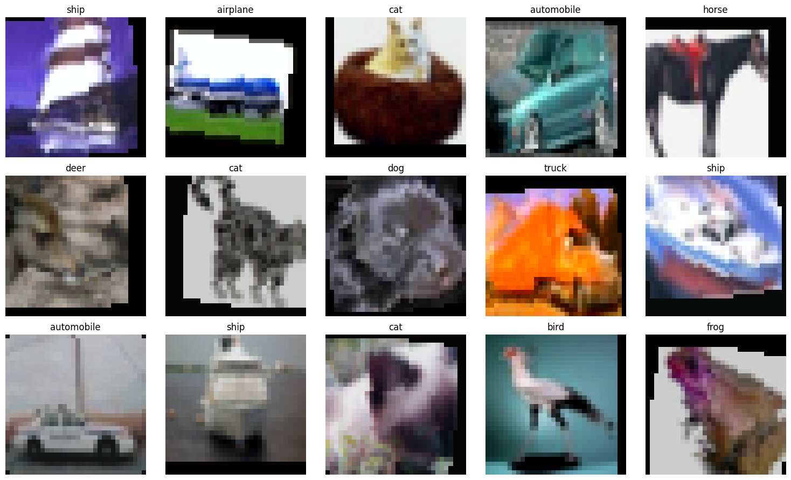
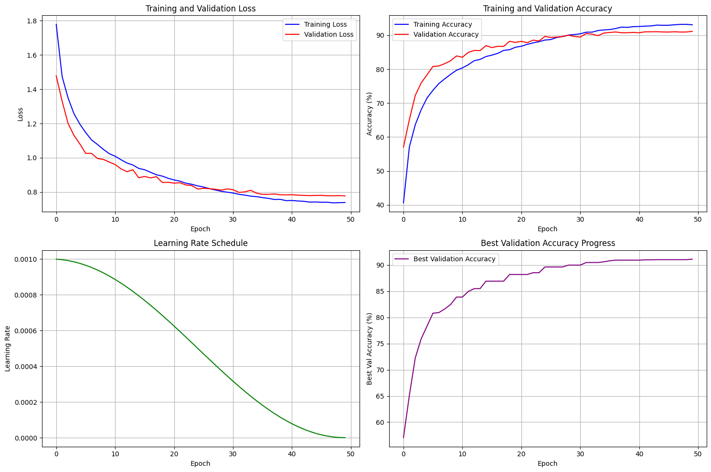
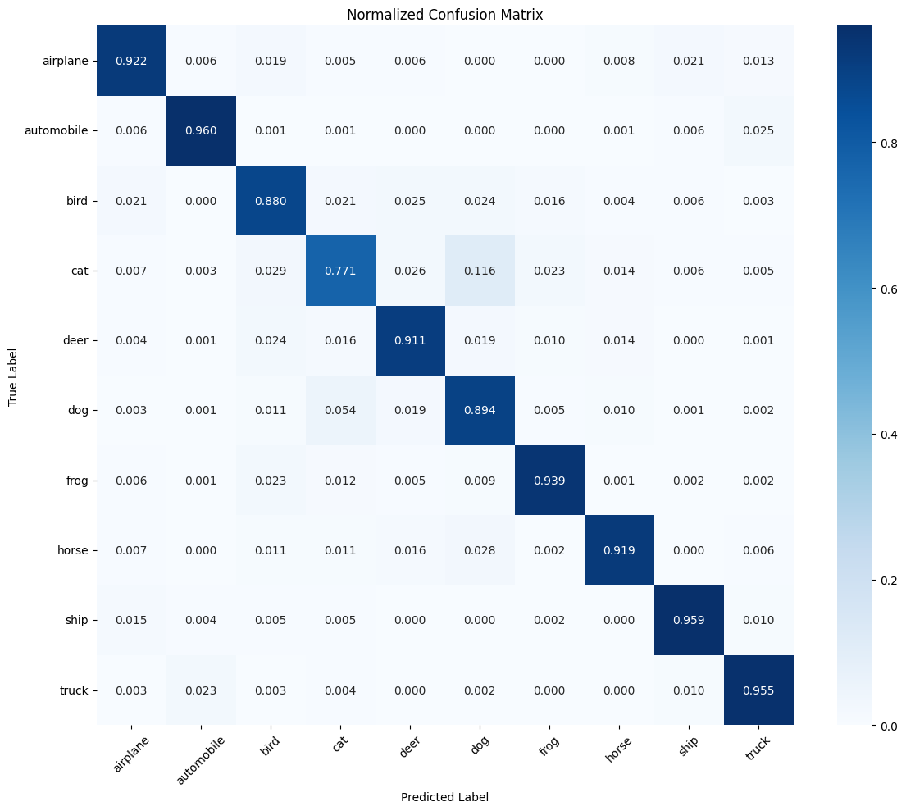
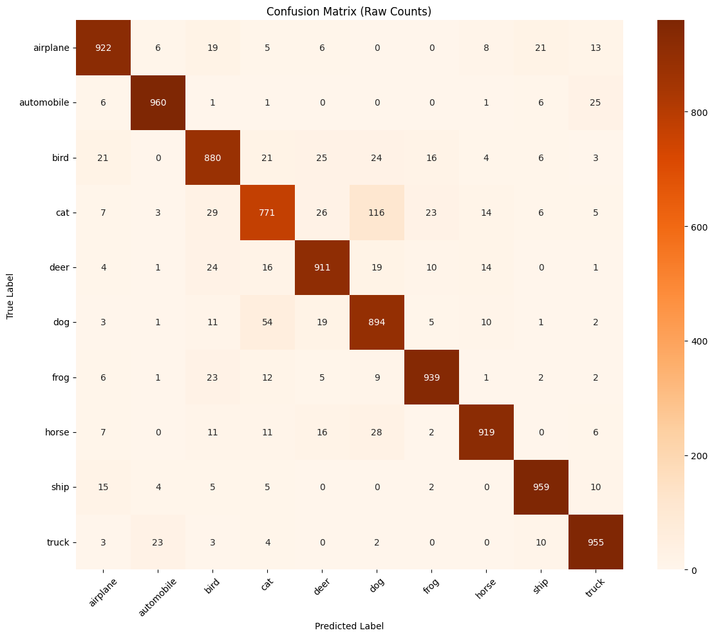
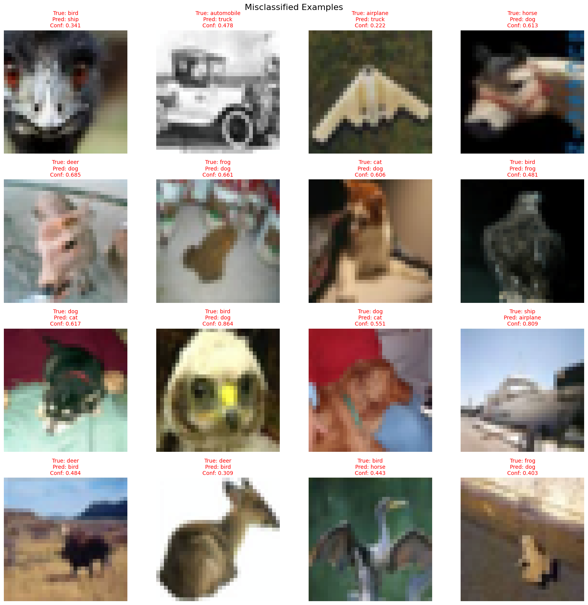
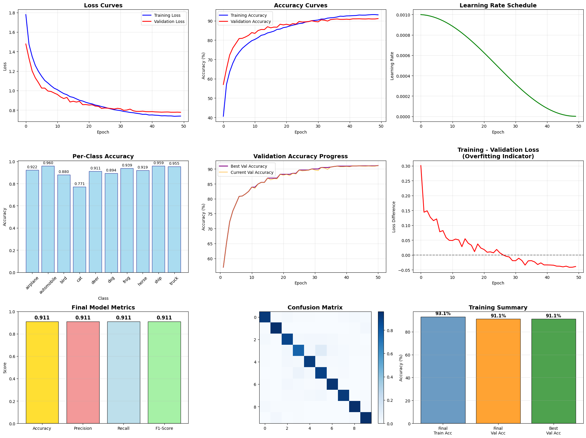
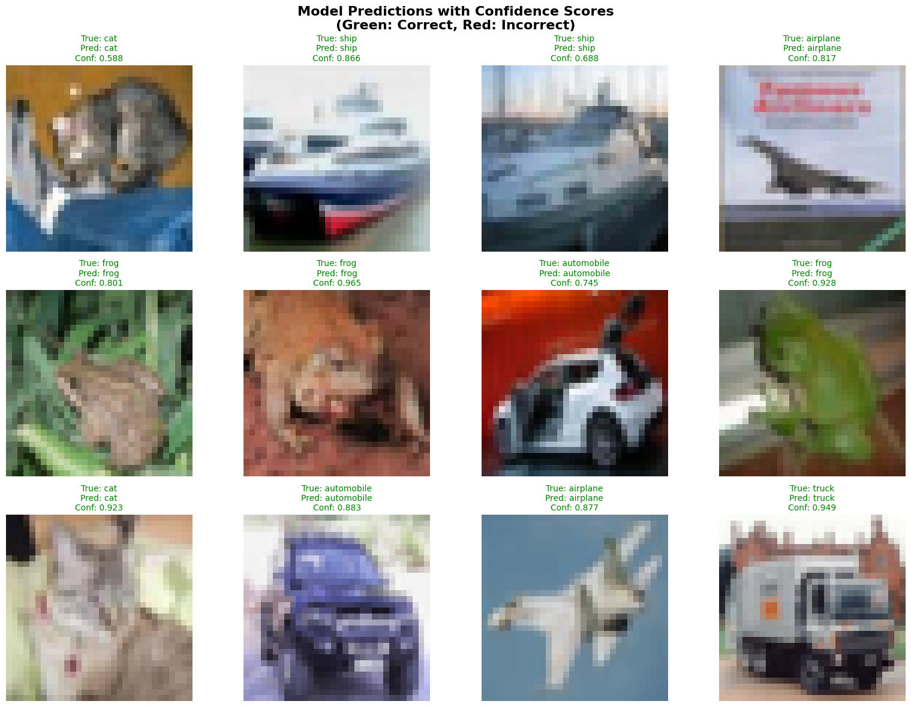
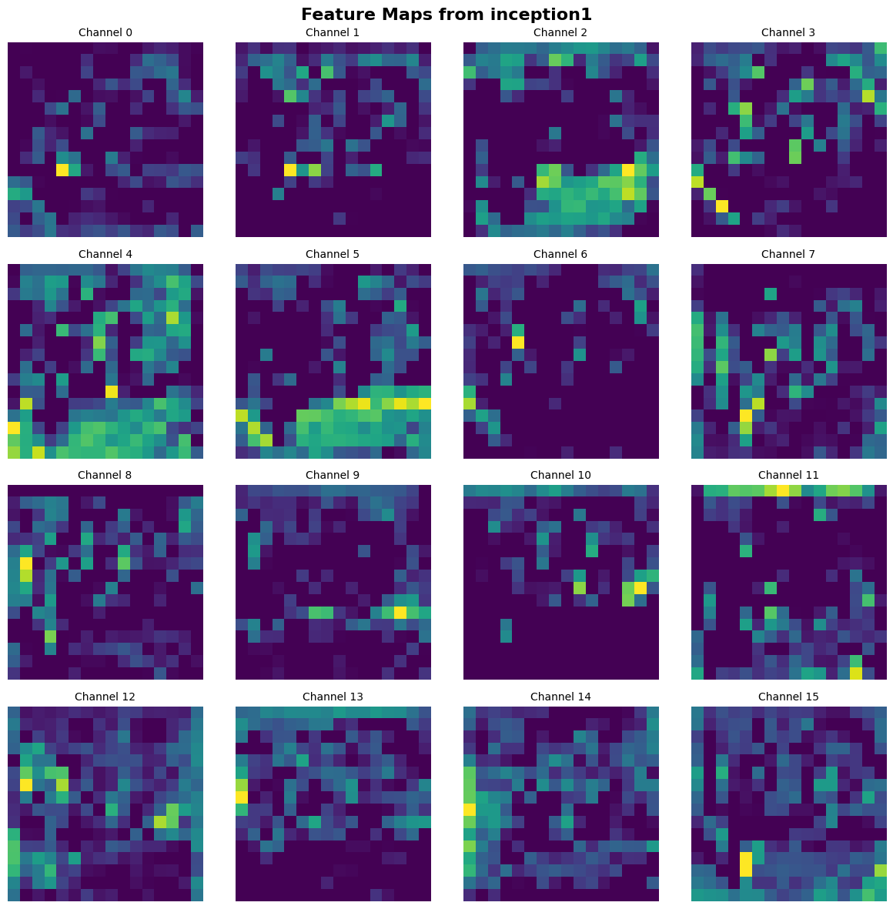

# CNN Image Classification on CIFAR-10

**Goal:** Train and evaluate a deep Convolutional Neural Network (CNN) with Inception-style modules for image classification on the **CIFAR-10 dataset**.

---

## Overview
This project implements a **custom CNN inspired by InceptionNet**, trained from scratch to classify 10 object categories (airplane, automobile, bird, cat, deer, dog, frog, horse, ship, truck).  
It integrates modern techniques such as **AdamW optimization**, **cosine learning rate scheduling**, and **feature map visualization** for interpretability.

---

##  Model Configuration
- **Dataset:** CIFAR-10 (50,000 train / 10,000 test samples)
- **Optimizer:** AdamW (lr = 0.001, weight decay = 0.01)
- **Scheduler:** CosineAnnealingLR
- **Loss Function:** CrossEntropyLoss
- **Training:** 50 epochs on CUDA
- **Architecture:**  
  - 4 × Inception-style modules (multi-branch convs: 1×1, 3×3, 5×5, pooling)  
  - Batch Normalization and Dropout regularization  
  - Fully-connected classifier with ReLU activations  
- **Total Parameters:** 3,300,618 (~12.6 MB)

---

## Performance Summary

| Metric | Score |
|---------|--------|
| **Training Accuracy** | 93.1% |
| **Validation Accuracy** | **91.1%** |
| **Test Accuracy** | **91.1%** |
| **Precision / Recall / F1** | 0.911 / 0.911 / 0.911 |
| **Best Classes** | Automobile (96%), Ship (96%), Truck (95.5%) |
| **Lowest Class** | Cat (77.1%) |

 **Overall assessment:** Stable convergence, balanced class performance, and excellent generalization.

---

##  Visual Results

### 1. CIFAR-10 Samples


### 2. Training Curves


### 3. Feature Map Visualization


### 4. Correct Predictions


### 5. Misclassified Examples


### 6. Confusion Matrices



### 7. Performance Summary


---

##  Highlights
- **Custom Inception-inspired architecture** improved feature diversity.
- Achieved **91.1% accuracy** with **excellent class balance**.
- **Cosine LR schedule** and **AdamW** optimizer stabilized long training.
- Visualized **feature maps and misclassifications** for interpretability.
- Demonstrated strong deep learning fundamentals and optimization control.

---

##  Technical Details
- Framework: **PyTorch**
- Hardware: NVIDIA GPU
- Techniques used: data augmentation, learning rate annealing, batch normalization, early stopping, confusion matrix analysis
- Model checkpoint: `inception_cnn_cifar10.pth`

---

##  How to Run
```bash
pip install -r ../requirements.txt
jupyter notebook
# open cnn_classification.ipynb
