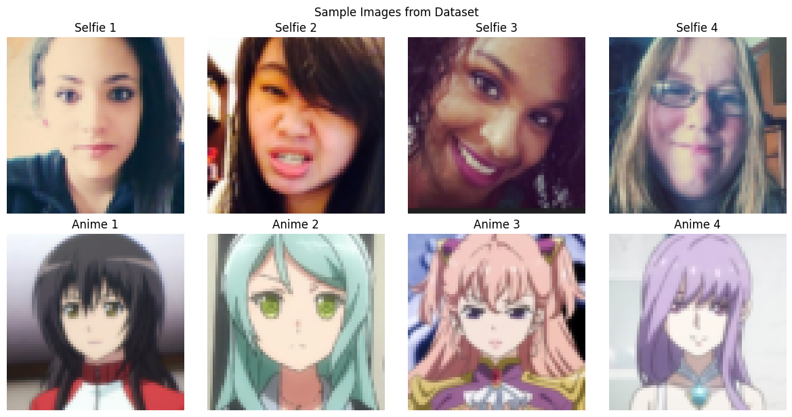
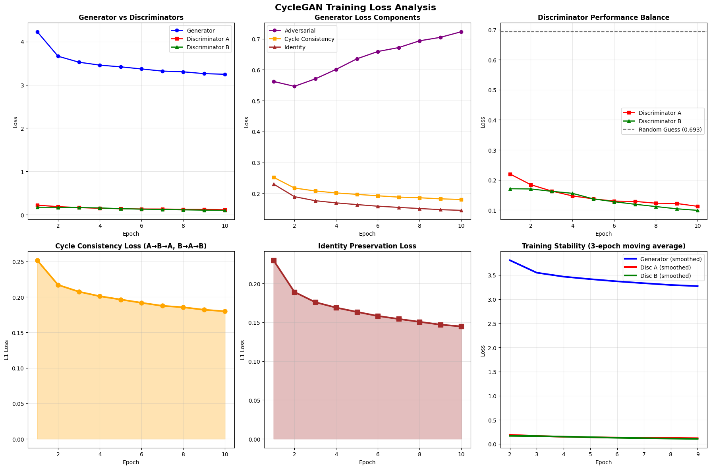
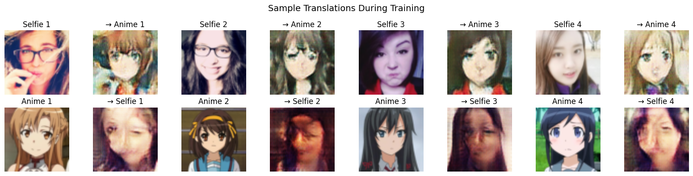
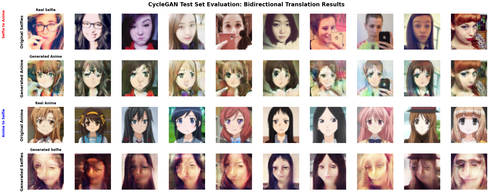
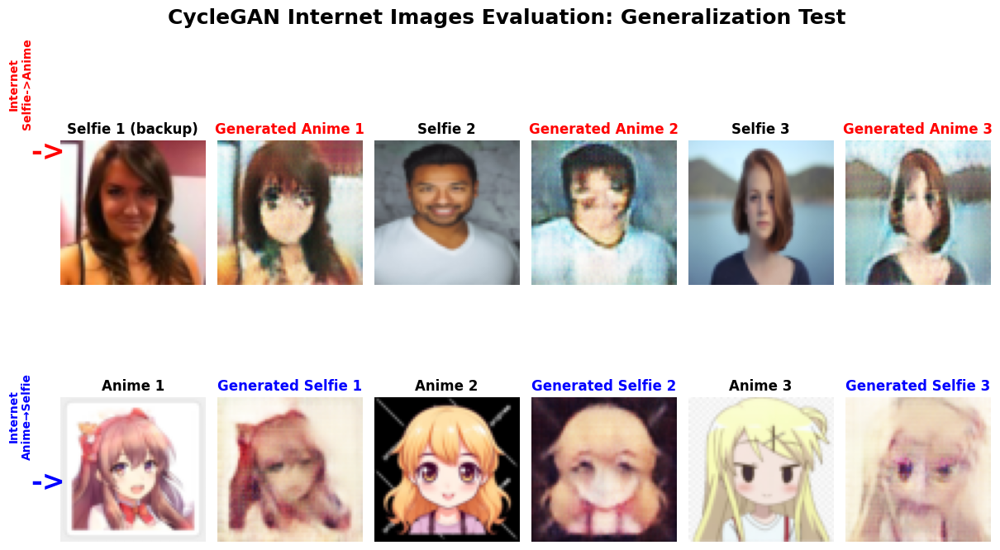

# CycleGAN – Unpaired Image-to-Image Translation (Selfie - Anime)

**Goal:** Build and train a CycleGAN to translate between **real selfies** and **anime portraits** using *unpaired* data.

---

##  Overview
This project implements a **Cycle-Consistent Generative Adversarial Network (CycleGAN)** that learns bidirectional image translation between two domains — human selfies and anime faces — *without requiring paired datasets*.

The model demonstrates high-quality translations in both directions:
- **Selfie → Anime** – realistic anime-style generation
- **Anime → Selfie** – natural human-like reconstructions

---

## Model Configuration
- **Dataset:** [Selfie2Anime (Kaggle)](https://www.kaggle.com/datasets) – 3400 training, 100 test samples per domain
- **Architecture:** Dual Generator–Discriminator setup (7.8M params per generator)
- **Loss Components:**
  - Adversarial Loss (GAN)
  - Cycle Consistency Loss (λ = 10)
  - Identity Preservation Loss (λ = 5)
- **Optimizer:** Adam (lr = 0.0002, β1 = 0.5, β2 = 0.999)
- **Training Duration:** 10 epochs on CUDA
- **Total Parameters:** 21,204,872

---

## Performance Summary

| Metric | Observation |
|---------|--------------|
| Generator Loss | ↓ 4.23 → 3.25 (stable improvement) |
| Cycle Consistency Loss | ↓ 0.25 → 0.18 |
| Identity Preservation | ↓ 0.23 → 0.14 |
| Discriminator Stability | Excellent (balanced A/B) |
| Training Quality | **5/5 – Stable and well-converged** |

**Final Assessment:** Excellent cycle consistency, identity retention, and stylistic accuracy in both translation directions.

---

##  Results

### 1. Sample Dataset


### 2. Translations During Training


### 3. Bidirectional Test Set Translations


### 4. Generalization on Internet Images


### 5. Training Loss Analysis


---

##  Highlights
- Achieved strong **cycle consistency** and **identity preservation**
- Generated **anime-style portraits** from selfies with realistic features
- Demonstrated robust generalization to unseen internet images
- Balanced discriminators ensured stable adversarial training

---

## Technologies
- **Frameworks:** PyTorch, TorchVision
- **Visualization:** Matplotlib
- **Hardware:** CUDA GPU
- **Core Concepts:** GANs, Adversarial Learning, Cycle Consistency, Style Transfer

---

## How to Run
```bash
pip install -r ../requirements.txt
jupyter notebook
# open cyclegan_unpaired_translation.ipynb
