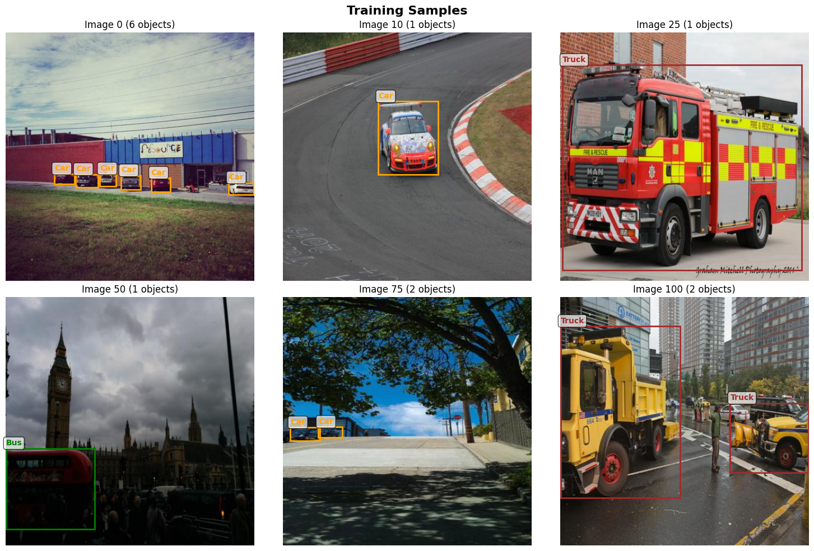
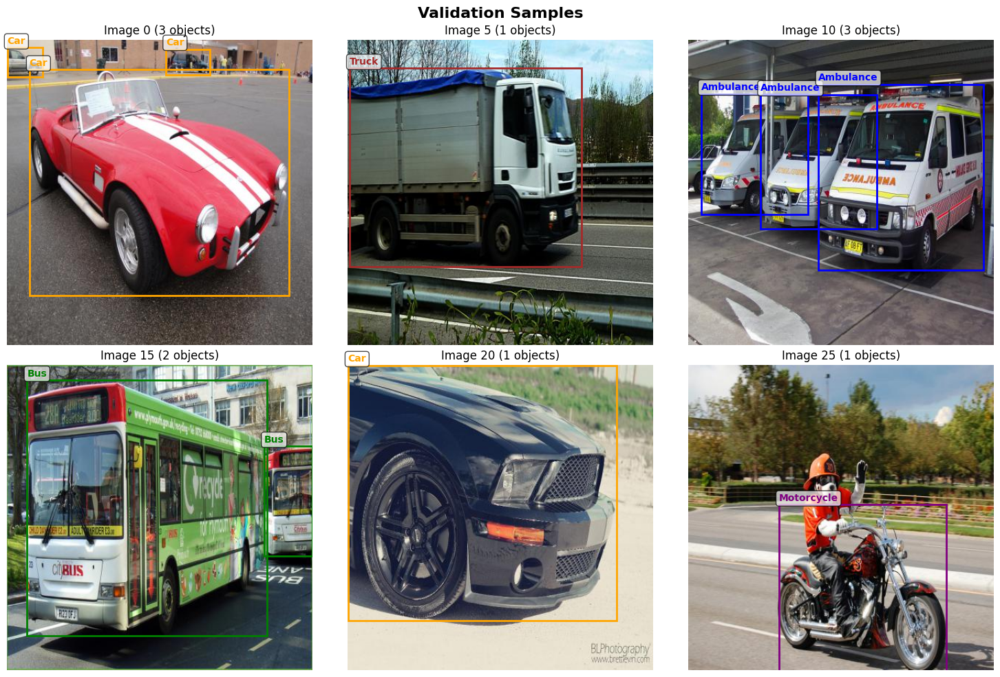
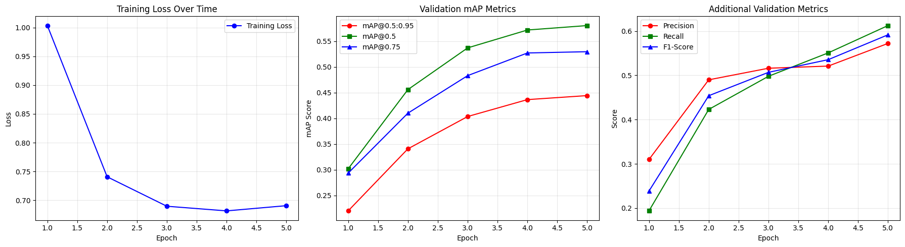
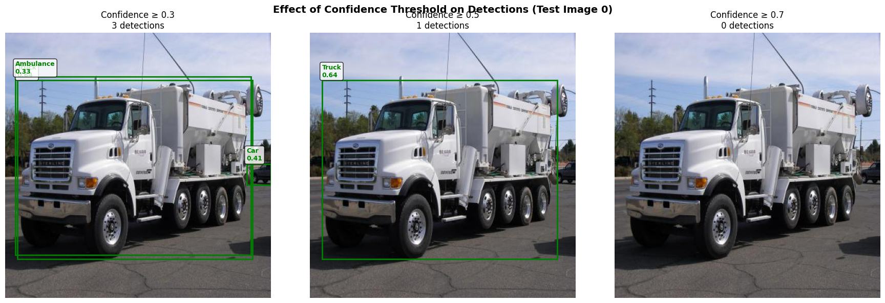

# Enhanced Faster R-CNN with Configurable Optimization

**Goal:** Vehicle detection and classification using a fine-tuned Faster R-CNN architecture with configurable optimization for production or research use.

## Overview
This project implements a **Faster R-CNN** model (MobileNet V3 + FPN backbone) for multi-class vehicle detection.  
It introduces *configurable optimization targets* — `high_precision`, `balanced`, and `high_recall` — allowing trade-offs between detection confidence and coverage.

Training and evaluation were conducted using PyTorch and Torchvision frameworks.

---

## Model Configuration
| Configuration | Precision | Recall | mAP@50 | Recommended Use |
|----------------|-----------|--------|---------|----------------|
| High Precision | 0.55 | 0.60 | **0.46** | Production |
| Balanced | 0.42 | 0.66 | 0.41 | General Use |
| High Recall | 0.10 | 0.74 | 0.15 | Safety-Critical |

Default setting: **High Precision** for balanced and reliable results.

---

## Key Features
- **Backbone:** MobileNet V3 Large + Feature Pyramid Network (FPN)
- **Optimizer:** AdamW with StepLR scheduler
- **Fine-tuning:** Only 3.4% of parameters trainable (selective layer unfreezing)
- **Metrics:** mAP@0.5:0.95, Precision, Recall, and F1-score
- **Performance:** Excellent generalization (Test mAP@0.5:0.95 = 0.4897)

---

## Results

| Metric | Validation | Test |
|---------|-------------|------|
| mAP@0.5:0.95 | 0.4441 | **0.4897** |
| mAP@0.5 | 0.5802 | **0.7143** |
| Precision | 0.5720 | **0.6371** |
| Recall | 0.6123 | **0.6124** |
| F1-score | 0.5915 | **0.6245** |

Excellent precision-recall balance and production-grade stability.

---

## Visual Results

### Confidence Threshold Comparison


### Predictions vs Ground Truth


### Training & Validation Metrics


### Validation Samples


### Training Samples


---

##  Requirements
torch
torchvision
numpy
matplotlib
pillow
scikit-learn
tqdm
jupyter

---

## How to Run
```bash
pip install -r ../requirements.txt
jupyter notebook
# open faster_rcnn_object_detection.ipynb
