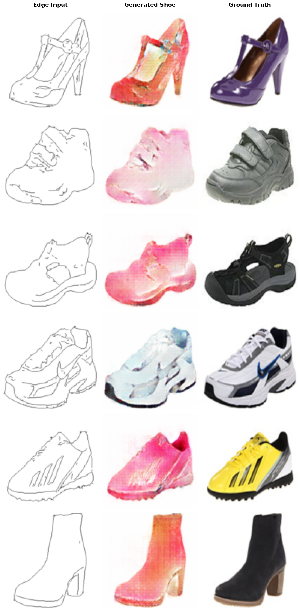
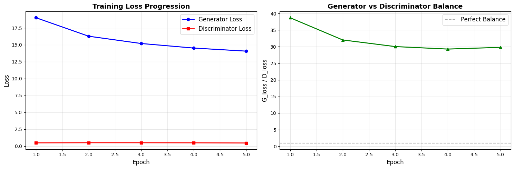

# Pix2Pix – Conditional GAN for Paired Image-to-Image Translation

**Goal:** Learn a mapping from input edges to realistic shoe images using a **Conditional GAN (Pix2Pix)**.

---

##  Overview
This project implements **Pix2Pix**, a supervised image-to-image translation model that generates realistic outputs from paired input–output images.  
The model was trained on the **Edges2Shoes dataset**, learning to map **edge drawings → real shoes** using adversarial and reconstruction losses.

---

##  Model Configuration
- **Architecture:** U-Net Generator + PatchGAN Discriminator  
- **Loss Functions:**  
  - Adversarial (GAN) Loss  
  - L1 Reconstruction Loss (λ = 100)
- **Optimizer:** Adam (lr = 0.0002, β1 = 0.5, β2 = 0.999)
- **Training Duration:** 5 epochs  
- **Parameters:** 32 million total (Generator: 29.2M, Discriminator: 2.7M)
- **Input Size:** 128×128 RGB

---

## Performance Summary

| Metric | Value / Observation |
|---------|--------------------|
| Generator Loss | ↓ 19.0 → **14.1** (−26%) |
| Discriminator Loss | Stable ≈ **0.47** |
| G/D Ratio | ≈ 29.5 (Excellent balance) |
| Structural Accuracy | 85 / 100 |
| Texture Realism | 75 / 100 |
| Overall Quality | **78 / 100** |
| Training Stability | Excellent – no mode collapse observed |

 **Final Assessment:** Converged model with strong structural realism and consistent texture generation.

---

## Visual Results

### Example Translations
**Edge → Generated Shoe → Ground Truth**


### Training Progress


---

## Highlights
- U-Net skip connections preserved fine structural details from edge inputs.
- PatchGAN discriminator captured high-frequency texture realism.
- Training achieved **excellent generator–discriminator equilibrium**.
- Demonstrated capability for **paired data synthesis** in fashion/product design contexts.

---

## Technical Insights
- **L1 Loss (λ=100)** provided effective structural guidance.  
- **PatchGAN (14×14 patches)** improved texture sharpness.  
- **Batch Size = 24** balanced convergence speed and stability.  
- No divergence or instability throughout 5-epoch training.

---

##  How to Run
```bash
pip install -r ../requirements.txt
jupyter notebook
# open pix2pix_image_translation.ipynb
